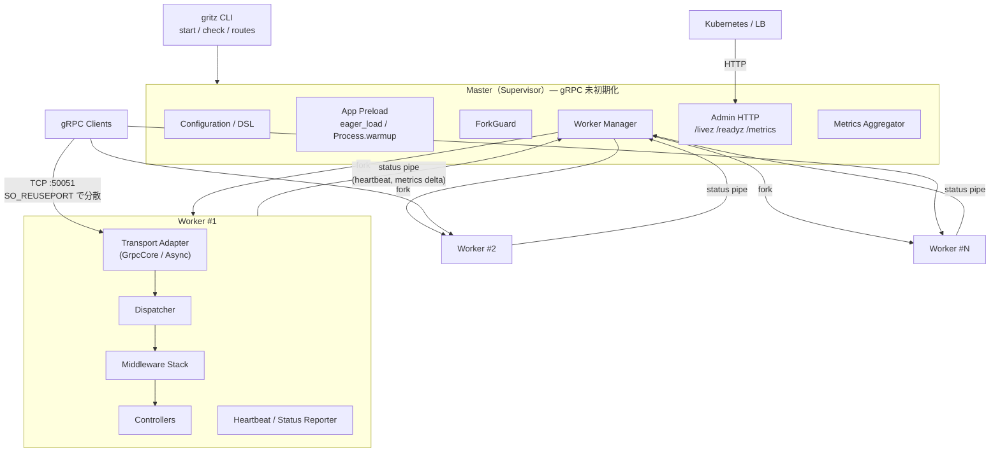
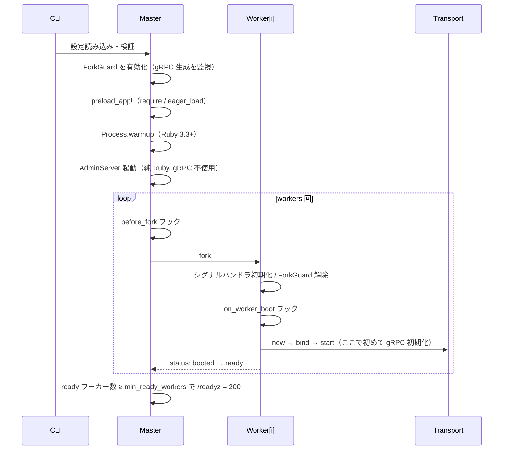
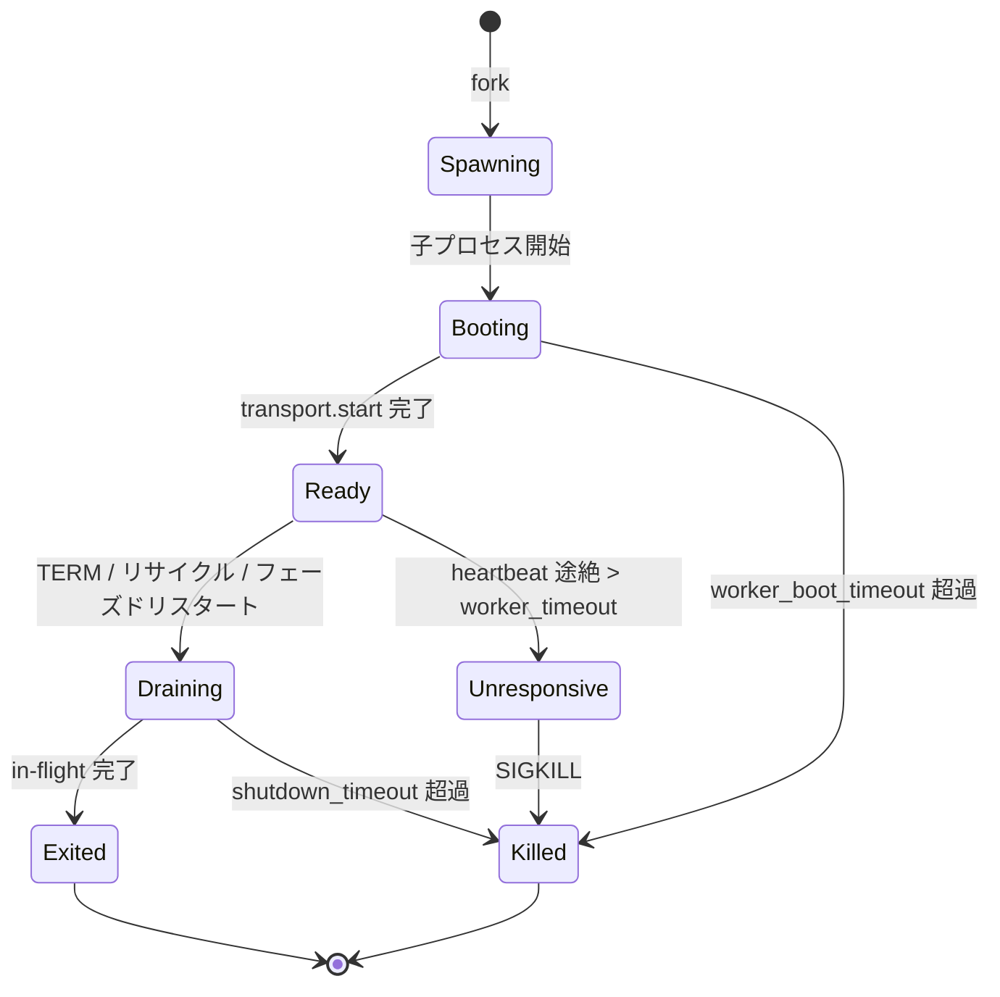

# Gritz 設計書

> **Gritz**（gRPC + blitz） — fork フレンドリーで本番運用に強い Ruby 向け gRPC アプリケーションフレームワーク
>
> ステータス: Draft v0.1 ／ 作成日: 2026-10-02 ／ 関連: [ROADMAP.md](./ROADMAP.md), [WORK_PROCEDURE.md](./WORK_PROCEDURE.md)

---

## 目次

1. [目的](#1-目的)
2. [背景と課題](#2-背景と課題)
3. [設計目標と非目標](#3-設計目標と非目標)
4. [設計原則](#4-設計原則)
5. [全体アーキテクチャ](#5-全体アーキテクチャ)
6. [プロセスモデル](#6-プロセスモデル)
7. [トランスポートアダプタ層](#7-トランスポートアダプタ層)
8. [アプリケーション層](#8-アプリケーション層)
9. [クライアント](#9-クライアント)
10. [標準サービス](#10-標準サービス)
11. [観測性](#11-観測性)
12. [設定](#12-設定)
13. [Rails 統合](#13-rails-統合)
14. [テスト支援](#14-テスト支援)
15. [CLI](#15-cli)
16. [セキュリティ](#16-セキュリティ)
17. [性能目標](#17-性能目標)
18. [gruf からの移行](#18-gruf-からの移行)
19. [gem 構成とディレクトリ](#19-gem-構成とディレクトリ)
20. [主要な設計判断（ADR 要約）](#20-主要な設計判断adr-要約)
21. [リスクと未決事項](#21-リスクと未決事項)
22. [用語集](#22-用語集)

---

## 1. 目的

gruf のような「コントローラ中心で書きやすい gRPC フレームワーク」の開発体験を保ちつつ、Puma / Unicorn / Pitchfork のような **preload + fork によるマルチプロセス運用** を第一級でサポートする Ruby 向け gRPC フレームワークを設計する。

ゴールは「Ruby で gRPC サーバを書くなら、プロセス管理・グレースフルシャットダウン・観測性・クライアントの fork 安全性まで含めて、これを使えば本番で困らない」状態を作ることである。

---

## 2. 背景と課題

### 2.1 grpc gem（C-core）と fork の相性

- 公式 `grpc` gem は gRPC C-core をラップしており、C-core 側と Ruby 側の双方にバックグラウンドスレッドを持つ。`fork(2)` は呼び出したスレッド以外を複製しないため、**gRPC を初期化した後に fork すると子プロセスの内部状態が壊れる**。
- 現行の grpc gem は fork 前後をまたいだ利用を検知して `RuntimeError`（`grpc cannot be used before and after forking unless the GRPC_ENABLE_FORK_SUPPORT env var is set ...`）を出す。
- 2023 年に実験的な fork サポート（`GRPC.prefork` / `GRPC.postfork_parent` / `GRPC.postfork_child` + `GRPC_ENABLE_FORK_SUPPORT=1`）が追加されたが、**クライアント側のみ・サーバ非対応・Bidi streaming 非対応・Linux のみ** という制約がある。
- 一方で「fork した**後**に初めて gRPC オブジェクトを生成する」使い方であれば fork は問題なく動作する、というのが公式ドキュメントの立場である。**本フレームワークはこの性質を基本戦略に据える。**
- 参考として Shopify の Pitchfork でも、親（mold）プロセスでは gRPC を無効のまま保つ運用が選ばれている。

### 2.2 gruf の構造的な限界

| 観点 | gruf の現状 | 問題 |
|---|---|---|
| プロセスモデル | `GRPC::RpcServer` を 1 プロセスで起動し、スレッドプールで処理 | GVL により CPU バウンド処理がコア数ぶんスケールしない |
| マルチコア活用 | プロセスを外部で複数起動（Pod を細かく分ける等） | preload + Copy-on-Write によるメモリ共有ができない |
| fork との共存 | フレームワークとしての保証なし | initializer で gRPC クライアントを作るとアプリ全体が fork 不可になる |
| 運用機能 | グレースフルシャットダウンやワーカー管理は利用者任せ | 本番ノウハウが各社に散在 |

### 2.3 gRPC 特有の運用課題

- **長寿命 HTTP/2 コネクション**: L4 の負荷分散は接続確立時にしか効かないため、プロセス間・Pod 間で負荷が偏る。
- **グレースフルシャットダウン**: in-flight RPC の完了待ち、GOAWAY 送出、Kubernetes の Endpoints 反映待ちを正しい順序で行う必要がある。
- **ヘルスチェックの整合**: `grpc.health.v1` と Kubernetes の readiness / liveness を矛盾なく連動させる必要がある。

### 2.4 Gritz が目指す位置付け

| 機能 | gruf | Gritz（目標） |
|---|---|---|
| コントローラ／インターセプタによる記述 | ✅ | ✅（gruf 互換レイヤあり） |
| 内蔵マルチプロセス（preload + fork） | ✗ | ✅ |
| fork 安全性の静的・動的検査 | ✗ | ✅ ForkGuard / `gritz check` |
| フェーズドリスタート・ワーカーリサイクル | ✗ | ✅ |
| fork 安全なクライアント（遅延生成・PID 追跡） | ✗ | ✅ |
| マルチプロセス対応メトリクス集約 | ✗ | ✅ |
| トランスポート差し替え（C-core / Fiber） | ✗ | ✅ |

---

## 3. 設計目標と非目標

### 3.1 目標

| ID | 目標 | 測定可能な受け入れ基準 |
|---|---|---|
| G1 | fork 安全性をフレームワークが保証する | master で gRPC オブジェクトが生成されたら起動時に検出し、発生箇所付きで報告できる |
| G2 | マルチコアを活かす | CPU バウンドな unary RPC のスループットがワーカー数にほぼ比例（コア数まで ±15%） |
| G3 | メモリ効率 | preload 時、2 台目以降のワーカーの追加 PSS が単一プロセス RSS の 40% 以下（Rails サンプルアプリ） |
| G4 | 無停止運用 | フェーズドリスタート中のエラー率 0%（クライアントのリトライなしで測定） |
| G5 | 書きやすさ | gruf 利用者が 1 日以内に移行できる。4 種の RPC すべてをコントローラで記述可能 |
| G6 | 観測性 | ログ・メトリクス・トレースが追加コードなしで出る |
| G7 | トランスポート非依存 | コントローラ／ミドルウェアのコードを変えずにアダプタを差し替え可能 |
| G8 | テスト容易性 | ネットワークなしでコントローラをテストでき、マルチプロセス挙動も CI で検証できる |

### 3.2 非目標

- 独自の Protocol Buffers 実装（`google-protobuf` を使用する）
- 独自の HTTP/2 実装（C-core または既存の Ruby HTTP/2 実装を使う）
- Windows 対応（シングルプロセスモードは動作してよいが保証しない）
- JRuby / TruffleRuby の正式サポート（1.0 時点では CRuby のみ）
- サービスメッシュ機能（xDS 等）の 1.0 時点での内蔵

---

## 4. 設計原則

| ID | 原則 | 内容 |
|---|---|---|
| P1 | **Clean Master Invariant** | master プロセスは gRPC C-core を一切初期化しない。gRPC のサーバ・チャネル・認証情報はすべてワーカー内で生成される |
| P2 | **Lazy & PID-aware** | gRPC リソースは初回利用時に遅延生成し、生成した PID に所有させる。PID が変わったら自動的に作り直す |
| P3 | **Transport-agnostic Core** | ルーティング・ミドルウェア・エラーモデル・コントローラはトランスポートを知らない |
| P4 | **Fail loudly at boot** | fork 安全性違反・未実装 RPC・設定ミスは、リクエストを受ける前に起動時に失敗させる |
| P5 | **Operability first** | シグナル・ヘルス・メトリクス・ログの挙動を仕様として文書化し、テストで固定する |
| P6 | **Familiar DX** | Puma 風の設定 DSL、gruf / Rails 風のコントローラ。新しい概念は最小限にする |

---

## 5. 全体アーキテクチャ



### レイヤと責務

| レイヤ | 主なクラス | 責務 | 動作プロセス |
|---|---|---|---|
| CLI | `Gritz::CLI` | 設定読み込み、モード選択、`check` / `routes` | master |
| Supervisor | `Gritz::Supervisor::Master`, `WorkerHandle` | fork、監視、シグナル処理、リサイクル、ドレイン | master |
| ForkGuard | `Gritz::ForkGuard` | master での gRPC 初期化の検出 | master / worker |
| Admin | `Gritz::Supervisor::AdminServer` | HTTP ヘルス・メトリクス公開（純 Ruby） | master |
| Worker Runner | `Gritz::Worker::Runner` | フック実行、トランスポート起動、状態報告 | worker |
| Transport | `Gritz::Transport::GrpcCore`, `Gritz::Transport::Async` | ワイヤプロトコル処理、`Call` 抽象の提供 | worker |
| Dispatcher | `Gritz::Dispatcher`, `Gritz::Router` | フルメソッド名からコントローラへのルーティング | worker |
| Middleware | `Gritz::Middleware::*` | 横断的関心事 | worker |
| Controller | `Gritz::Controller` | アプリケーションロジック | worker |
| Client | `Gritz::Client` | fork 安全な遅延チャネル、デッドライン伝播 | worker（master では生成禁止） |

---

## 6. プロセスモデル

### 6.1 起動シーケンス



### 6.2 Clean Master と ForkGuard

**不変条件**: master は gRPC C-core を初期化しない。`require "grpc"` 自体は C-core を初期化しない（公式の fork テストでも require 直後は未初期化として扱われている）ため、ライブラリのロードは許可し、**オブジェクトの生成のみ** を監視する。

**検出方法**

1. master でのブート開始時、以下のクラスの `initialize` に `Module#prepend` でフックを差し込む。
   - `GRPC::Core::Channel`, `GRPC::Core::Server`, `GRPC::Core::ChannelCredentials`, `GRPC::Core::ServerCredentials`, `GRPC::Core::CallCredentials`, `GRPC::ClientStub`, `GRPC::RpcServer`
2. フックは `ForkGuard.master?`（PID 比較）が真なら `caller_locations` を添えて違反を記録する。
3. `fork_guard` 設定に応じて `:raise`（既定）／`:warn`／`:off` の挙動を取る。
4. ワーカーでは PID が異なるためフックは素通りする（オーバーヘッドは PID 比較 1 回のみ）。

**違反時のメッセージ例**

```text
Gritz::ForkSafetyError: gRPC object was created in the master process before fork.
  GRPC::Core::Channel.new
    from config/initializers/payment_client.rb:12
    from app/models/payment.rb:3
Fix: use Gritz::Client (lazy, fork-safe) or create it in an on_worker_boot hook.
```

**fork_mode**

| 値 | 説明 | 用途 |
|---|---|---|
| `:clean`（既定） | master では gRPC 生成を禁止 | 通常はこれ |
| `:grpc_fork_support`（実験的） | `GRPC_ENABLE_FORK_SUPPORT=1` を前提に、fork 前後で `GRPC.prefork` / `postfork_*` を呼ぶ | 起動時にリモート設定サーバへ gRPC で問い合わせる必要がある等。Linux 限定、master での Bidi 利用不可 |

### 6.3 リスニングソケット戦略

| 戦略 | 既定となるアダプタ | 仕組み | 長所 | 短所 |
|---|---|---|---|---|
| `reuseport` | GrpcCore | 各ワーカーが同一アドレスに `SO_REUSEPORT` 付きで bind。カーネルが接続をハッシュ分散 | master が gRPC に触れずに済む。実装が単純 | Linux 前提。リスナを閉じると accept キュー内の接続が落ちうる（6.7 参照） |
| `inherited_fd` | Async | master が bind し、FD をワーカーへ継承 | Puma と同じモデル。systemd ソケットアクティベーション対応 | C-core アダプタでは Ruby バインディングが FD 受け渡しを公開していないため使えない |
| `port_per_worker` | 任意 | ワーカーごとに別ポート。前段に Envoy 等 | どの環境でも動く | 外部プロキシが必要 |

制約と検証:

- `reuseport` かつ `workers > 1` でポート `0`（エフェメラル）指定は各ワーカーが別ポートを得てしまうため **起動時エラー** とする。
- macOS の `SO_REUSEPORT` は負荷分散しないため、macOS では `workers > 1` 指定時に警告し、開発用途は `workers 0`（シングルモード）を推奨する。
- C-core の `grpc.so_reuseport` は既定で有効と想定しているが、Phase 0 のスパイクで実バージョンごとに確認し、Gritz は明示的に `1` を設定する。

### 6.4 コネクション偏り対策

gRPC の接続は長寿命なので、`SO_REUSEPORT` の分散は **接続確立時点** にしか効かない。これを補うため以下を既定値として設定する。

| 設定 | C-core チャネル引数 | Gritz 既定値 | 目的 |
|---|---|---|---|
| `max_connection_age` | `grpc.max_connection_age_ms` | 300 秒 | 一定時間で GOAWAY を送り、再接続させて再分散 |
| `max_connection_age_grace` | `grpc.max_connection_age_grace_ms` | 30 秒 | GOAWAY 後に in-flight RPC を完了させる猶予 |
| `keepalive_time` | `grpc.keepalive_time_ms` | 60 秒 | 半開き接続の検出 |
| `keepalive_permit_without_calls` | `grpc.keepalive_permit_without_calls` | 1 | アイドル接続の維持 |

クライアント側（`Gritz::Client`）は既定で `round_robin` + `dns:///` ターゲットを推奨構成としてドキュメント化する。

### 6.5 ワーカーのライフサイクル



**ステータスパイプ**

- 各ワーカーは fork 時に作成した `IO.pipe` の書き込み側を持ち、専用スレッドから `status_interval`（既定 1 秒）ごとに JSON Lines を送る。
- 送信内容: `pid`, `state`, `ts`, `inflight`, `busy_threads`, `capacity`, `oldest_inflight_age`, `requests_total`, メトリクス差分。
- master は `IO.select` でパイプを監視し、`worker_timeout`（既定 30 秒）以上更新がなければ `Unresponsive` と判定する。
- C 拡張が GVL を握り続けるとハートビートスレッドも止まるため、それ自体がハング検出になる。
- 「ハートビートは届くが特定 RPC が長時間終わらない」ケースは `oldest_inflight_age` で検出し、ログとメトリクスで警告する（自動 kill はオプトイン）。

### 6.6 シグナル

| シグナル | master の動作 | worker の動作 |
|---|---|---|
| `TERM` | グレースフルシャットダウン（6.7） | ドレインして終了 |
| `INT` | `TERM` と同じ（開発時の Ctrl-C） | 同上 |
| `QUIT` | 即時停止（ワーカーへ `QUIT`） | 即時停止 |
| `USR1` | フェーズドリスタート（1 台ずつ入れ替え） | — |
| `USR2` | ホットリエクゼク（新 master を exec、旧 master は新側 Ready 後に退役） | — |
| `TTIN` / `TTOU` | ワーカー数を ±1 | — |
| `HUP` | ログファイルの再オープン | ログファイルの再オープン |
| `CHLD` | 子プロセスの回収（`waitpid` ループ） | — |

シグナルハンドラ内では処理を行わず、**self-pipe trick**（キューに積んでパイプに 1 バイト書くだけ）でメインループに委譲する。

### 6.7 グレースフルシャットダウン手順

1. master が `TERM` を受信する。`/readyz` を即座に 503 にし、全ワーカーへ「health を NOT_SERVING に」と通知する。
2. `drain_delay`（既定 5 秒）待機する。Kubernetes の Endpoints 更新や LB のヘルスチェック反映を待つためである。
3. 全ワーカーへ `TERM` を送る。各ワーカーは新規 RPC の受付を停止し（C-core は GOAWAY を送出）、in-flight RPC の完了を待つ。
4. `shutdown_timeout`（既定 25 秒）を超えた RPC はキャンセルし、それでも残るワーカーには `SIGKILL` を送る。
5. 全ワーカーを回収したら master は終了する。

> Kubernetes では `terminationGracePeriodSeconds` を `drain_delay + shutdown_timeout + 余裕` 以上（例: 40 秒）に設定する。

**`SO_REUSEPORT` 固有の注意**: あるワーカーがリスナを閉じると、そのリスナの accept キューに滞留していた未 accept 接続はリセットされうる。対策として以下を組み合わせる。

- Linux 5.14 以降の `net.ipv4.tcp_migrate_req=1` を推奨設定としてドキュメント化する（滞留接続を同じ reuseport グループの他リスナへ移す）。
- フェーズドリスタートでは「新ワーカーが Ready → 旧ワーカーをドレイン」の順を厳守し、同時に閉じるリスナを常に 1 つにする。
- クライアントは `UNAVAILABLE` を透過リトライ可能に設定する（`Gritz::Client` の既定サービスコンフィグに含める）。

### 6.8 ワーカーのリサイクル

| 条件 | 設定 | 判定場所 |
|---|---|---|
| 処理リクエスト数 | `max_requests`（+ `jitter` で一斉リサイクルを回避） | worker が自己申告 |
| メモリ | `max_rss_mb` または `max_pss_mb` | master が `/proc/<pid>/smaps_rollup` を定期読み取り |
| 稼働時間 | `max_lifetime` | master |

リサイクルは常にフェーズド方式（新ワーカーを起動 → Ready 後に旧ワーカーをドレイン）で行い、容量を落とさない。一時的に `workers + phased_restart_surge`（既定 1）台になることを許容する。

### 6.9 Copy-on-Write 最適化

- `preload_app!` 時は master でアプリを完全にロードする（Rails なら `eager_load!`）。
- fork 直前に `Process.warmup`（Ruby 3.3+）を 1 回呼び、GC・コンパクション・`malloc_trim` を済ませてから fork する。
- `gritz stats` で各ワーカーの PSS / USS を表示し、CoW 効果を運用者が確認できるようにする。
- 将来検討: Pitchfork 型の「温まったワーカーからの reforking」。Clean Master Invariant と両立させるには gRPC をドレイン・破棄してから fork する必要があり、Phase 6 以降の研究課題とする。

### 6.10 シングルプロセスモード

`workers 0` で fork を行わず、master 自身がワーカーとして動作する。開発環境・macOS・テスト向けであり、Rails のコードリロード（13 章参照）はこのモードでのみ有効にする。

---

## 7. トランスポートアダプタ層

### 7.1 インタフェース

```ruby
module Gritz
  module Transport
    class Base
      # @return [Set<Symbol>] :unary, :server_streaming, :client_streaming, :bidi,
      #                       :reuseport, :inherited_fd, :fiber, :tls, :mtls
      def self.capabilities = raise NotImplementedError

      def initialize(config:, dispatcher:, logger:); end

      # worker 内で呼ぶ。listener_spec は reuseport / inherited_fd を表す
      def bind(listener_spec) = raise NotImplementedError
      def start = raise NotImplementedError          # ノンブロッキング
      def wait = raise NotImplementedError           # 終了までブロック
      def stop(deadline:) = raise NotImplementedError # グレースフル
      def kill = raise NotImplementedError            # 強制

      # @return [Hash] inflight:, busy:, capacity:, rejected_total:
      def stats = raise NotImplementedError
    end
  end
end
```

トランスポートは RPC ごとに **`Gritz::Call`** を実装したオブジェクトを作り、`dispatcher.call(call)` を呼ぶ。

```ruby
module Gritz
  # トランスポート非依存の RPC 抽象
  module Call
    def method_descriptor; end   # Gritz::MethodDescriptor（service, name, 型, ストリーミング種別）
    def metadata; end            # 受信メタデータ（Hash, -bin はデコード済み）
    def deadline; end            # Time | nil
    def peer; end                # "ipv4:10.0.0.1:43210"
    def peer_identity; end       # mTLS 時のクライアント証明書情報
    def cancelled?; end
    def read; end                # 次のメッセージ or nil（client/bidi）
    def each_message(&); end
    def write(message); end      # server/bidi
    def send_initial_metadata(md = {}); end
    def trailing_metadata; end   # 書き込み可能な Hash
  end
end
```

### 7.2 GrpcCore アダプタ（既定）

- `bind` で指定された各コントローラの `Service` クラス（`grpc_tools_ruby_protoc` 生成物）から、`Class.new(ServiceClass)` でブリッジクラスを動的に生成し、`rpc_descs` に定義された各 RPC のハンドラメソッドを定義する。
- ハンドラは grpc gem のビュー（`SingleReqView` 等）を `GrpcCoreCall` でラップし、`dispatcher.call` を呼ぶ。
- **server streaming** は `Enumerator.new { |y| ... }` を返し、その中でディスパッチを実行する。コントローラの `stream.write(msg)` は `y << msg` に対応する。grpc gem は戻り値を内部イテレーションで消費するため同期的に送信され、ミドルウェアはストリーム全体を包むことができる（挙動は T1-09 で検証する）。
- 例外は `GRPC::BadStatus.new_status_exception(code, details, metadata)` に変換し、リッチエラーは `grpc-status-details-bin` トレーラに `google.rpc.Status` として格納する。
- スレッドプールは `threads`（= `pool_size`）と `max_waiting_requests` で構成する。超過時の `RESOURCE_EXHAUSTED` はメトリクス `gritz_rejected_total` に計上する。
- `server_args` にはソケット・接続寿命・キープアライブ・メッセージサイズ上限を設定から変換して渡す。
- 制約: FD 継承は不可のため `reuseport` 専用とする。

### 7.3 Async アダプタ（Phase 6）

- `async-grpc`（`protocol-grpc` + `async-http` ベース、Ruby 3.3+）を下回りに使い、各 RPC を Fiber で処理する。I/O バウンドなワークロードで高い同時実行数を得られる。
- 純 Ruby のため fork と相性が良く、master が bind したソケットを継承する `inherited_fd` 戦略を取れる。
- 将来の Connect プロトコルや gRPC-Web 対応の土台になる（HTTP/1.1 も扱えるため）。
- 注意点:
  - DB ドライバ等が Fiber Scheduler に対応している必要がある。
  - Rails では `ActiveSupport::IsolatedExecutionState.isolation_level = :fiber` が必要になる。
  - `async-grpc` は 0.x 系であり、API 変更リスクがある（21 章参照）。

### 7.4 ケイパビリティ比較

| 機能 | GrpcCore | Async |
|---|---|---|
| unary / server / client / bidi | ✅ / ✅ / ✅ / ✅ | ✅ / ✅ / ✅ / ✅（Phase 0 で相互運用性を検証） |
| reuseport | ✅ | ✅ |
| inherited_fd | ✗ | ✅ |
| 同時実行モデル | スレッドプール | Fiber |
| CPU バウンド性能 | ◎（C-core の HTTP/2 処理は GVL 外） | ○ |
| 成熟度 | 高 | 発展途上 |

### 7.5 アダプタ契約テスト

`Gritz::Testing::TransportContract` という共有テストスイートを用意し、全アダプタが同一の振る舞い（ステータスコード、トレーラ、デッドライン、キャンセル、メタデータ、ストリーミング順序、グレースフル停止）を満たすことを CI で保証する。

---

## 8. アプリケーション層

### 8.1 コントローラ

```ruby
class GreeterController < Gritz::Controller
  bind Helloworld::Greeter::Service

  before_action :authenticate!

  # unary
  def say_hello
    user = User.find(request.message.user_id)
    Helloworld::HelloReply.new(message: "Hello, #{user.name}")
  end

  # server streaming
  def list_greetings
    Greeting.where(lang: request.message.lang).find_each do |g|
      context.check_deadline!
      stream.write Helloworld::Greeting.new(text: g.text)
    end
  end

  # client streaming
  def record_names
    count = request.each_message.count { |m| Name.create!(value: m.name) }
    Helloworld::Summary.new(count: count)
  end

  # bidi streaming
  def chat
    request.each_message do |m|
      stream.write Helloworld::ChatReply.new(text: m.text.upcase)
    end
  end

  private

  def authenticate!
    fail!(:unauthenticated, "token required") unless context.metadata["authorization"]
  end
end
```

- アクション名は RPC 名の snake_case（`SayHello` → `say_hello`）。
- 1 リクエストにつき 1 インスタンスを生成し、インスタンス変数のリクエスト間共有を防ぐ。
- `before_action` / `around_action` / `after_action` / `rescue_from` を提供する（ActiveSupport 非依存の軽量実装）。

### 8.2 ルーティング

- 起動時に全コントローラの `bind` を走査し、`/helloworld.Greeter/SayHello` → `GreeterController#say_hello` のルート表を構築する。
- 同一サービスの二重 bind はエラーとする。
- `rpc_descs` に存在するのにアクションが未定義の RPC は `UNIMPLEMENTED` を返す。起動時に一覧を警告し、`strict_routes true` ならエラーとする。
- `gritz routes` でルート表を出力する。

### 8.3 コンテキスト

`Gritz::Context.current` で取得する。格納には Fiber storage（`Fiber[]`）を使い、スレッドモデルと Fiber モデルの両方で正しく分離・継承されるようにする。

| フィールド | 内容 |
|---|---|
| `request_id` | 受信した `x-request-id`、なければ生成 |
| `metadata` | 受信メタデータ |
| `deadline` / `remaining` | 絶対時刻と残り時間 |
| `method` | `MethodDescriptor` |
| `peer` / `peer_identity` | 接続元、mTLS の証明書情報 |
| `trace_context` | OpenTelemetry のスパンコンテキスト |
| `logger` | リクエスト情報付きのロガー |
| `store` | ミドルウェア間で共有する Hash |

### 8.4 エラーモデル

- ステータスコードごとの例外クラス階層を用意する: `Gritz::Error` < `StandardError`、その下に `Gritz::Errors::NotFound`, `InvalidArgument`, `Unauthenticated`, ... を置く。
- コントローラからは `fail!(:not_found, "user not found", details: [Google::Rpc::ResourceInfo.new(...)], metadata: {})` で発生させる。
- `details` は `google.rpc.Status` にパックして `grpc-status-details-bin` に載せる。
- 例外マッピングは設定可能とし、既定では以下を変換する。

| 例外 | ステータス |
|---|---|
| `Gritz::Error` 系 | 自身のコード |
| `ActiveRecord::RecordNotFound` | `NOT_FOUND` |
| `ActiveRecord::RecordInvalid` | `INVALID_ARGUMENT`（`BadRequest` 詳細付き） |
| `Gritz::DeadlineExceeded` | `DEADLINE_EXCEEDED` |
| `GRPC::BadStatus`（下流呼び出しの失敗） | 既定では `INTERNAL` に丸める（素通しは設定で可能） |
| その他 `StandardError` | `INTERNAL`（本番ではメッセージを隠し、`error_id` のみ返す） |

### 8.5 ミドルウェア

Rack 風のインタフェースを採用する。ストリーミング RPC ではストリーム全体を 1 回の `call` で包む。

```ruby
class MyAuthMiddleware
  def initialize(app, **opts)
    @app = app
  end

  def call(ctx)
    raise Gritz::Errors::Unauthenticated unless valid?(ctx.metadata["authorization"])
    @app.call(ctx)
  end
end
```

メッセージ単位の処理が必要な場合は、任意で `on_receive(ctx, msg)` / `on_send(ctx, msg)` を実装する。

**既定スタック（外側から順）**

| # | ミドルウェア | 役割 |
|---|---|---|
| 1 | `RequestId` | リクエスト ID の付与・伝播 |
| 2 | `Context` | コンテキスト確立、デッドライン解釈 |
| 3 | `Tracing` | OpenTelemetry スパン（有効時） |
| 4 | `Metrics` | レイテンシ・ステータス別カウント |
| 5 | `Logging` | 1 RPC 1 行の構造化ログ |
| 6 | `ExceptionMapper` | 例外からステータスへの変換 |
| 7 | `RailsExecutor` | `Rails.application.executor.wrap`（Rails 時のみ） |
| 8 | ユーザー定義 | 認証・認可など |
| 9 | Controller | — |

`config.middleware.insert_before / insert_after / use / delete / swap` で編集できる。

### 8.6 デッドラインとキャンセル

- `Timeout.timeout` は使わない（非同期例外は安全でないため）。
- `context.check_deadline!` による協調的チェックと、`Gritz::Client` によるデッドライン伝播で実現する。下流呼び出しのデッドラインは `min(クライアント既定値, ctx.remaining - safety_margin)` とする。
- クライアントからのキャンセルは `context.cancelled?` で検知でき、ストリーミング中に定期確認することを推奨する。

### 8.7 バリデーション（プラグイン）

`protovalidate` 系ルールによる入力検証を `gritz-validate` プラグインとして提供することを検討する。Ruby 実装の成熟度は要調査とし、1.0 必須要件にはしない。

---

## 9. クライアント

```ruby
# 定数定義は master のロード時でも安全（チャネルは初回呼び出しまで作られない）
GreeterClient = Gritz::Client.define(
  Helloworld::Greeter::Stub,
  target: "dns:///greeter.default.svc.cluster.local:50051",
  credentials: :insecure,
  deadline: 1.0,
  service_config: {
    loadBalancingConfig: [{ round_robin: {} }],
    methodConfig: [{
      name: [{ service: "helloworld.Greeter" }],
      retryPolicy: {
        maxAttempts: 3, initialBackoff: "0.1s", maxBackoff: "1s",
        backoffMultiplier: 2, retryableStatusCodes: ["UNAVAILABLE"]
      }
    }]
  }
)

reply = GreeterClient.say_hello(Helloworld::HelloRequest.new(name: "gritz"))
```

**fork 安全性**

- チャネルは `ChannelRegistry` が `(Process.pid, target, credentials, args)` をキーに保持し、初回呼び出し時に生成する。
- Ruby 3.1+ の `Process._fork` フックで子プロセス側のレジストリを破棄する。PID 比較でも二重に防御する。
- master で呼び出された場合は ForkGuard 違反として扱う（`fork_mode :grpc_fork_support` を除く）。
- チャネルはスレッドセーフなので、1 プロセス・1 ターゲットにつき 1 チャネルを共有する。

**機能**

- デッドラインの既定値と伝播、`x-request-id`・トレースコンテキストの自動付与
- クライアントミドルウェア（サーバ側と同じインタフェース）
- `GRPC::BadStatus` から `Gritz::Errors::*` への変換（リッチエラー詳細のデコード付き）
- サービスコンフィグによるリトライ・LB（C-core 機能を利用）
- 将来: サーキットブレーカ、ヘッジング（プラグイン）

---

## 10. 標準サービス

| サービス | 実装方針 | 既定 |
|---|---|---|
| `grpc.health.v1.Health` | `Check` と `Watch` の両方を自前実装。サービス単位のステータスを持ち、ワーカー状態（Draining 中は NOT_SERVING）とユーザー定義チェックに連動させる | 有効 |
| `grpc.reflection.v1` / `v1alpha` | `DescriptorPool` から `FileDescriptorProto` を取り出して応答する。生成コードの `add_serialized_file` をフックして直列化済み記述子を収集する方式を Phase 0 で検証する | 開発環境のみ有効 |
| Admin HTTP（master） | `/livez`（master 生存）、`/readyz`（Ready ワーカー数 ≥ `min_ready_workers` かつ非ドレイン）、`/metrics`、`/status`（JSON） | 有効 |

Admin サーバは master 上で動くため gRPC を使わず、`TCPServer` ベースの最小 HTTP/1.1 実装とする（依存ゼロ）。

---

## 11. 観測性

### 11.1 ログ

- 1 RPC につき 1 行の構造化ログ（JSON / logfmt）を出力する。項目: `request_id`, `service`, `method`, `code`, `duration_ms`, `peer`, `worker`, `pid`, `bytes_in`, `bytes_out`。
- `debug_redact` フィールドオプション、または設定によるフィールドマスキングでペイロード中の機微情報を隠す（Ruby からのフィールドオプション参照可否は Phase 0 で確認する）。

### 11.2 メトリクス

**RPC メトリクス**（OpenTelemetry の RPC セマンティック規約に準拠した名前）

- `rpc.server.duration`（ヒストグラム。ラベル: `rpc.service`, `rpc.method`, `rpc.grpc.status_code`）
- `rpc.server.requests_per_rpc`, `rpc.server.responses_per_rpc`（ストリーミング）
- `rpc.client.duration` ほかクライアント側

**プロセスメトリクス**

- `gritz_workers{state}`
- `gritz_worker_restarts_total{reason}`
- `gritz_threadpool_busy`, `gritz_threadpool_capacity`
- `gritz_rejected_total`
- `gritz_worker_pss_bytes`

**マルチプロセス集約**（`metrics_backend` で選択）

| バックエンド | 仕組み | 既定 |
|---|---|---|
| `:pipe`（内蔵） | ワーカーがステータスパイプでカウンタ・ヒストグラムの差分を送り、master が集約して `/metrics` で公開 | ✅ |
| `:otlp` | 各ワーカーが OTLP で Collector へ直接送信し、集約は Collector が行う | — |
| `:mmap` | `prometheus-client-mmap` 等の共有ファイル方式 | — |

### 11.3 トレース

- OpenTelemetry Ruby SDK と統合し、W3C `traceparent` をメタデータで受け渡す。
- サーバスパン・クライアントスパンを自動生成する。
- SDK の初期化（BatchSpanProcessor のスレッド起動）は `on_worker_boot` で行うことをフレームワークが自動化する（master でエクスポータスレッドを起動しない）。

---

## 12. 設定

`config/gritz.rb`（Puma 風 DSL）。優先順位は **CLI 引数 > 環境変数（`GRITZ_*`）> 設定ファイル > 既定値**。

```ruby
# config/gritz.rb
workers Integer(ENV.fetch("GRITZ_WORKERS") { Etc.nprocessors })
threads 16                     # GrpcCore: スレッドプールサイズ
max_waiting_requests 64
transport :grpc_core           # :grpc_core | :async
bind "0.0.0.0:50051"
admin_bind "0.0.0.0:9090"

preload_app!
fork_mode :clean               # :clean | :grpc_fork_support（実験的）
fork_guard :raise              # :raise | :warn | :off

drain_delay 5
shutdown_timeout 25
worker_boot_timeout 60
worker_timeout 30
min_ready_workers 1

max_connection_age 300
max_connection_age_grace 30
keepalive_time 60
max_receive_message_size 4 * 1024 * 1024

worker_recycle max_requests: 50_000, max_pss_mb: 1024, jitter: 0.1

before_fork        { }
on_worker_boot     { |index| }
on_worker_shutdown { |index| }

tls cert: "/etc/tls/tls.crt", key: "/etc/tls/tls.key", client_ca: "/etc/tls/ca.crt"

middleware do |stack|
  stack.insert_after Gritz::Middleware::Logging, MyAuthMiddleware
end

health_check(:database) { ActiveRecord::Base.connection_pool.with_connection(&:active?) }
```

設定は起動時に型・範囲・組み合わせ（例: `reuseport` + ポート 0 + `workers > 1`）を検証し、不正なら起動を中止する。

---

## 13. Rails 統合（`gritz-rails`）

- Railtie で以下を設定する。
  - `app/rpc/**/*_controller.rb` のオートロード
  - `bin/gritz` binstub の生成
  - ジェネレータ（`rails g gritz:install`, `rails g gritz:controller Greeter`）
- **preload**: master で `Rails.application.eager_load!` を実行する。
- **リクエスト境界**: `RailsExecutor` ミドルウェアで `Rails.application.executor.wrap` を行う。これにより AR 接続の返却、クエリキャッシュ、`CurrentAttributes` のリセットが行われる。
- **fork 前後**: Rails 自身の fork 追跡に加え、`before_fork` で AR の接続を明示的に切断する（多重防御）。
- **開発時**: シングルモードでのみ `Rails.application.reloader.wrap` によるコードリロードを有効にする。
- **生成コードの扱い**: `*_pb.rb` / `*_services_pb.rb` は Zeitwerk の命名規約に従わないため、既定で `lib/protos/`（オートロード対象外）に置き、`config/initializers/gritz.rb` で明示的に require するテンプレートを生成する。

---

## 14. テスト支援

```ruby
RSpec.describe GreeterController, type: :rpc do
  it "returns greeting" do
    reply = rpc(:say_hello, Helloworld::HelloRequest.new(user_id: user.id),
                metadata: { "authorization" => "Bearer x" })
    expect(reply.message).to eq "Hello, Alice"
  end

  it "requires auth" do
    expect { rpc(:say_hello, Helloworld::HelloRequest.new) }
      .to raise_rpc_error(:unauthenticated)
  end

  it "streams" do
    replies = rpc(:chat, [msg1, msg2])   # 入力は配列 / Enumerator
    expect(replies.map(&:text)).to eq %w[A B]
  end
end
```

- `rpc` はネットワークを経由せず、`InMemoryCall` でディスパッチャを直接呼ぶ。ミドルウェアは既定で通し、`middleware: false` で外せる。
- `Gritz::Testing::Server.start` で実ソケット（エフェメラルポート、シングルモード）を起動する E2E ヘルパを提供する。
- マルチプロセステスト用に `Gritz::Testing::Cluster`（ワーカー起動・シグナル送信・状態待機）を提供する。Linux の CI でのみ実行する。
- Minitest 用アサーションも同等に提供する。

---

## 15. CLI

| コマンド | 内容 |
|---|---|
| `gritz start [-C config/gritz.rb]` | サーバ起動 |
| `gritz check` | 設定検証と fork 安全性検査。preload まで実行して ForkGuard の違反を列挙し、違反があれば終了コード 1（CI 用） |
| `gritz routes` | ルート表の出力 |
| `gritz stats` | 稼働中 master の `/status` を整形表示（PSS 含む） |
| `gritz restart` / `gritz stop` | PID ファイルまたは Admin API 経由でシグナルを送信 |

---

## 16. セキュリティ

- TLS / mTLS を設定で宣言できるようにし、mTLS 時は `peer_identity` で証明書の SAN 等を参照可能にする。
- 証明書ローテーションは、まずフェーズドリスタート（`USR1`）で対応する。ファイル監視による自動リスタートはオプションとする。
- メッセージサイズ上限（受信・送信）とメタデータサイズ上限を既定で設定する。
- 本番では例外メッセージやバックトレースをクライアントに返さない（`error_id` で相関を取る）。
- Reflection は既定で本番無効とする。
- 依存 gem の脆弱性チェック（`bundler-audit`）を CI に含める。

---

## 17. 性能目標

以下はすべて **目標値** であり、Phase 6 のベンチマークで検証・更新する。

| 指標 | 目標 |
|---|---|
| フレームワークのオーバーヘッド（素の `GRPC::RpcServer` 比、unary、p50） | +5% 以内 |
| ワーカー数に対するスループットのスケーリング | コア数まで線形 ±15% |
| 2 台目以降のワーカー追加 PSS（Rails サンプル、preload あり） | 単一プロセス RSS の 40% 以下 |
| フェーズドリスタート中のエラー率 | 0% |
| `TERM` から終了まで（in-flight なし） | `drain_delay` + 1 秒以内 |

ベンチマークは `ghz` で unary（軽量／CPU バウンド／I/O 待ち）、server streaming、bidi の各シナリオを固定し、結果を JSON でリポジトリに保存して回帰を検知する。

---

## 18. gruf からの移行

`gritz-gruf-compat`（または `Gritz::Compat::Gruf`）を提供する。

| gruf | Gritz での扱い |
|---|---|
| `Gruf::Controllers::Base` + `bind` | 互換クラスをそのまま継承可能 |
| `request.message`, `request.messages`, `fail!` | 同名 API で提供 |
| `Gruf::Interceptors::ServerInterceptor#call` | ミドルウェアへアダプト（`Gritz::Compat::Gruf.interceptor(MyInterceptor)`） |
| `Gruf.configure` | 主要項目を `config/gritz.rb` へ変換するスクリプトを提供 |

**移行手順**: gem 追加 → 互換モードで起動（`workers 0`）→ `gritz check` で fork 安全性を修正 → `workers N` に切り替え → 互換 API を段階的にネイティブ API へ置換。

---

## 19. gem 構成とディレクトリ

モノレポで複数 gem を管理し、コアをトランスポート非依存に保つ。

| gem | 内容 | 主な依存 |
|---|---|---|
| `gritz-core` | Supervisor, ForkGuard, Dispatcher, Controller, Middleware, Client 抽象, Testing | `google-protobuf` |
| `gritz-grpc` | GrpcCore アダプタ、C-core クライアント実装 | `grpc`, `googleapis-common-protos` |
| `gritz-async` | Async アダプタ | `async-grpc` |
| `gritz-rails` | Railtie, ジェネレータ, `RailsExecutor` | `railties` |
| `gritz-otel` | OpenTelemetry 統合 | `opentelemetry-sdk` |
| `gritz` | メタ gem（`gritz-core` + `gritz-grpc`） | — |

```text
gritz/
├── gems/
│   ├── gritz-core/lib/gritz/
│   │   ├── cli.rb  configuration.rb  dsl.rb
│   │   ├── supervisor/  master.rb  worker_handle.rb  signal_queue.rb
│   │   │               status_channel.rb  admin_server.rb  metrics_aggregator.rb
│   │   ├── worker/      runner.rb  heartbeat.rb
│   │   ├── fork_guard.rb
│   │   ├── transport/   base.rb  listener_spec.rb
│   │   ├── call.rb  context.rb  dispatcher.rb  router.rb  method_descriptor.rb
│   │   ├── controller.rb  controller/filters.rb
│   │   ├── errors.rb  error_mapper.rb
│   │   ├── middleware/  request_id.rb  context.rb  metrics.rb  logging.rb  exception_mapper.rb
│   │   ├── client/      definition.rb  channel_registry.rb
│   │   ├── services/    health.rb  reflection.rb
│   │   └── testing/     rpc_helper.rb  in_memory_call.rb  server.rb  cluster.rb  transport_contract.rb
│   ├── gritz-grpc/lib/gritz/transport/grpc_core/  server.rb  bridge.rb  call.rb  client.rb
│   ├── gritz-async/ ...
│   ├── gritz-rails/ ...
│   └── gritz-otel/ ...
├── examples/   hello/  rails_app/  streaming/
├── spikes/     s01_reuseport/ ...
├── bench/      scenarios/  results/
└── docs/       adr/  spikes/  guides/
```

---

## 20. 主要な設計判断（ADR 要約）

| ADR | 決定 | 理由 | 却下した代替案 |
|---|---|---|---|
| 001 | master は gRPC を初期化しない（Clean Master） | 公式 fork サポートはサーバ非対応・Bidi 非対応・Linux 限定で、実験的扱い | `GRPC.prefork` 前提の設計 |
| 002 | GrpcCore では `SO_REUSEPORT` でリスナを共有 | Ruby バインディングで FD 継承ができない。master が gRPC に触れずに済む | master が受け付けてワーカーへプロキシ（二重コピーで遅い） |
| 003 | トランスポートをアダプタ化 | Fiber ベース実装の台頭に備え、C-core 依存リスクを分散する | grpc gem 直結 |
| 004 | Rack 風ミドルウェア | 学習コストが低く、ストリーム全体を包める | grpc gem のインターセプタ API 直結（4 種の RPC で別メソッドになり冗長） |
| 005 | メトリクスは既定で master 集約 | マルチプロセスで正しい値を出す。外部依存なし | ワーカーごとに別ポートでエクスポート |
| 006 | `Timeout` を使わない協調的デッドライン | 非同期例外による状態破壊を避ける | `Timeout.timeout` |
| 007 | モノレポ・複数 gem | コアを軽量に保ち、アダプタを独立リリースできる | 単一 gem |

---

## 21. リスクと未決事項

| # | リスク／未決事項 | 影響 | 対応 |
|---|---|---|---|
| R1 | grpc gem の将来バージョンで fork 検知やソケット挙動が変わる | 高 | CI で grpc gem の複数バージョンをテストし、毎リリースでスパイクを再実行 |
| R2 | `SO_REUSEPORT` ドレイン時の接続リセット | 中 | `tcp_migrate_req`、フェーズド順序、クライアントリトライ（6.7） |
| R3 | ForkGuard の検出漏れ（C 拡張内部から直接生成される経路など） | 中 | `gritz check` での fork 後スモーク RPC 実行による実地検査を併用 |
| R4 | `async-grpc` の成熟度と API 変更 | 中 | Async アダプタを別 gem・実験扱いで提供し、1.0 の必須要件にしない |
| R5 | Reflection 実装に必要な記述子取得 API | 低 | Phase 0 で検証し、不可なら生成時に記述子セットを出力する方式へ切替 |
| R6 | 名前の衝突（GitHub・商標） | 低 | RubyGems は確認済み。Phase 0 でプレースホルダ gem を公開して名前を確保し、GitHub・商標も確認 |
| Q1 | Bidi で受信と送信を別スレッド／Fiber にする API を公開するか | — | Phase 1 で利用例を集めて決定 |
| Q2 | Pitchfork 型 reforking の採否 | — | Phase 6 以降に研究 |
| Q3 | Connect / gRPC-Web をコアで扱うか、別 gem にするか | — | 1.0 以降に決定 |

---

## 22. 用語集

| 用語 | 意味 |
|---|---|
| master | ワーカーを fork・監視する親プロセス。gRPC を初期化しない |
| worker | 実際に RPC を処理する子プロセス |
| C-core | gRPC の C/C++ 実装。`grpc` gem の下回り |
| CoW | Copy-on-Write。fork 後もページを書き換えるまで親子で共有する仕組み |
| PSS | Proportional Set Size。共有ページを按分したメモリ使用量 |
| ドレイン | 新規受付を止め、in-flight 処理の完了を待つこと |
| フェーズドリスタート | ワーカーを 1 台ずつ入れ替える無停止再起動 |
