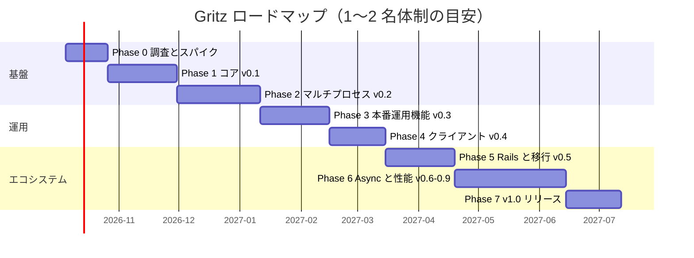

# Gritz ロードマップ

> **Gritz**（gRPC + blitz） — fork フレンドリーな Ruby 向け gRPC フレームワーク
>
> 作成日: 2026-10-02 ／ 関連: [DESIGN.md](./DESIGN.md), [WORK_PROCEDURE.md](./WORK_PROCEDURE.md)

---

## 1. ビジョン

> **「Ruby で gRPC サーバを書くなら Gritz。プロセス管理から観測性まで、本番で困らない。」**

gruf の書きやすさを保ちつつ、次の 3 点で「最強」を目指す。

1. **fork 前提の設計** — preload + マルチプロセスで、マルチコアと CoW を最大限に活かす。
2. **運用の作り込み** — グレースフルシャットダウン、フェーズドリスタート、ワーカーリサイクル、マルチプロセス対応メトリクスを標準装備する。
3. **将来への備え** — トランスポートをアダプタ化し、C-core と Fiber（Async）ベースの両方に対応する。

---

## 2. 前提

| 項目 | 前提 |
|---|---|
| 体制 | コア開発者 1〜2 名 + レビュアー 1 名 |
| 対応 Ruby | CRuby 3.3 以上（メンテナンス中の全バージョンを CI で検証） |
| 対応 OS | Linux（本番・マルチプロセス）、macOS（開発・シングルモード） |
| ライセンス | MIT |
| バージョニング | SemVer。0.x の間は minor で破壊的変更あり（CHANGELOG に明記） |

---

## 3. 全体スケジュール

| Phase | バージョン | テーマ | 目安期間 | 目安時期 |
|---|---|---|---|---|
| 0 | — | 調査・スパイク・Go/No-Go 判断 | 3 週 | 2026-10 |
| 1 | v0.1.0 | コア（シングルプロセス） | 5 週 | 2026-10 〜 11 |
| 2 | v0.2.0 | マルチプロセス Supervisor | 6 週 | 2026-12 〜 2027-01 |
| 3 | v0.3.0 | 本番運用機能 | 5 週 | 2027-01 〜 02 |
| 4 | v0.4.0 | クライアント・伝播・トレース | 4 週 | 2027-02 〜 03 |
| 5 | v0.5.0 | Rails 統合・gruf 互換・Reflection | 5 週 | 2027-03 〜 04 |
| 6 | v0.6〜0.9 | Async アダプタ・性能・堅牢化 | 8 週 | 2027-04 〜 06 |
| 7 | v1.0.0 | API 凍結・ドキュメント・リリース | 4 週 | 2027-06 〜 07 |

> 期間は目安。各 Phase の完了条件を満たすまで次へ進まない（期間より品質を優先）。

---

## 4. Phase 詳細

### Phase 0: 調査・スパイク（3 週）

**目的**: 設計の前提が実際に成り立つかを、最小コードで確かめる。

| スパイク | 検証内容 |
|---|---|
| S-01 | master 未初期化 + fork + ワーカーごとの `RpcServer`（`SO_REUSEPORT`）で正しく分散・スケールするか |
| S-02 | 負荷中のワーカー停止でどれだけエラーが出るか（`tcp_migrate_req` の有無、`max_connection_age` の効果） |
| S-03 | ForkGuard の検出方式（`prepend` による C 定義クラスへのフック）が機能するか、`require "grpc"` だけでは未初期化か |
| S-04 | `fork_mode :grpc_fork_support`（`GRPC.prefork` 系 API）の実用性 |
| S-05 | Reflection 用の記述子取得方法 |
| S-06 | `async-grpc` と grpc gem クライアント・grpcurl の相互運用性（4 種の RPC） |
| S-07 | Rails アプリの preload + `Process.warmup` による PSS 削減量 |
| S-08 | gem 名の確保（プレースホルダ公開）、GitHub・商標の確認、ライセンス・リポジトリ準備 |

**成果物**: `docs/spikes/S-0x.md`（結果レポート）、ADR 001〜003 の確定版

**完了条件（Go/No-Go）**

- S-01 で 4 ワーカー時に CPU バウンド RPC のスループットが 1 ワーカー比 3.4 倍以上 → **Go**
- S-02 で `tcp_migrate_req=1` かつフェーズド順序のとき、ワーカー入れ替え中のエラーが 0 件 → **Go**
- いずれかが不成立の場合は、ADR 002 を `port_per_worker` + プロキシ方式へ変更して再計画する

---

### Phase 1: コア v0.1（5 週）

**目的**: シングルプロセスで gruf 相当の開発体験を実現する。

**スコープ**

- 設定オブジェクトと DSL（プロセス関連の項目はパースのみ）
- エラー階層、`fail!`、リッチエラー詳細
- `Context`（Fiber storage）、`Call` 抽象、`InMemoryCall`
- `Controller`（`bind`、4 種の RPC、`before_action` / `around_action` / `rescue_from`）
- `Router` / `Dispatcher` / ミドルウェアスタック
- 標準ミドルウェア（`RequestId` / `Context` / `Logging` / `ExceptionMapper`）
- GrpcCore アダプタ（シングルモード）
- テストヘルパ（RSpec / Minitest）
- CLI: `gritz start`（`workers 0`）、`gritz routes`
- サンプルアプリ `examples/hello`

**完了条件**

- 4 種の RPC がサンプルで動き、grpcurl から呼べる
- テストヘルパでネットワークなしにコントローラをテストできる
- 行カバレッジ 90% 以上
- README のクイックスタートが 5 分以内に完了する

---

### Phase 2: マルチプロセス v0.2（6 週）

**目的**: 本フレームワークの核心である fork 安全なマルチプロセス運用を実現する。

**スコープ**

- `Supervisor::Master`（self-pipe 方式のシグナル処理、fork、`waitpid` による回収、欠員補充）
- `Worker::Runner`、ステータスパイプ、ハートビート
- ForkGuard（`:raise` / `:warn` / `:off`）と `gritz check`
- フック（`before_fork` / `on_worker_boot` / `on_worker_shutdown`）
- `preload_app!` + `Process.warmup`
- グレースフルシャットダウン（`drain_delay` → `TERM` → `shutdown_timeout` → `KILL`）
- `TTIN` / `TTOU`、`HUP`
- `fork_mode :grpc_fork_support`（実験的）
- Linux 限定のマルチプロセス統合テスト（`Gritz::Testing::Cluster`）

**完了条件**

- master で gRPC オブジェクトを作るアプリを `gritz check` が発生箇所付きで検出する
- `TERM` 時に in-flight RPC が完了してから終了する（統合テストで固定）
- ワーカーを `SIGKILL` しても 1 秒以内に補充される
- 1 時間の連続負荷試験でリーク・ハングがない

---

### Phase 3: 本番運用機能 v0.3（5 週）

**目的**: Kubernetes で安心して使えるレベルに引き上げる。

**スコープ**

- フェーズドリスタート（`USR1`）、ホットリエクゼク（`USR2`）
- ワーカーリサイクル（`max_requests` / `max_pss_mb` / `max_lifetime` + jitter）
- `max_connection_age` 等の既定値適用
- Admin HTTP サーバ（`/livez` `/readyz` `/metrics` `/status`）
- Health サービス（`Check` / `Watch`）とワーカー状態の連動
- メトリクス（パイプ集約バックエンド）、構造化ログ
- TLS / mTLS
- 運用ガイド（Kubernetes マニフェスト例、`terminationGracePeriodSeconds`、sysctl 設定）

**完了条件**

- フェーズドリスタート中に `ghz` で負荷をかけてもエラー 0 件
- `/metrics` の値が全ワーカー合計と一致する（統合テスト）
- kind（Kubernetes in Docker）上でローリングアップデートのシナリオテストに合格

---

### Phase 4: クライアント v0.4（4 週）

**目的**: サーバ・クライアント双方で fork 安全性と伝播を完成させる。

**スコープ**

- `Gritz::Client.define`（遅延生成チャネル、PID 追跡、`Process._fork` フック）
- デッドライン伝播、`x-request-id` とトレースコンテキストの伝播
- クライアントミドルウェア、エラー変換（リッチ詳細のデコード）
- サービスコンフィグ（リトライ・LB）のサポート
- `gritz-otel`（サーバ・クライアントのスパン、OTLP メトリクスバックエンド）

**完了条件**

- master 定義のクライアント定数が、各ワーカーで独立したチャネルとして動作する
- サーバ → クライアント → サーバの 3 段呼び出しで、デッドラインとトレースが連結される

---

### Phase 5: Rails 統合と移行 v0.5（5 週）

**目的**: 既存の Rails + gruf 利用者が乗り換えられる状態にする。

**スコープ**

- `gritz-rails`（Railtie、ジェネレータ、`RailsExecutor`、開発時リロード）
- gruf 互換レイヤと移行ガイド・設定変換スクリプト
- Reflection サービス
- `examples/rails_app`（ActiveRecord + マルチワーカー）

**完了条件**

- gruf を使った OSS のサンプル（または社内アプリ）1 件を、互換レイヤで 1 日以内に移行できる
- Rails サンプルで PSS 目標（DESIGN.md 17 章）を満たす

---

### Phase 6: Async アダプタ・性能・堅牢化 v0.6〜0.9（8 週）

**目的**: トランスポート非依存性を実証し、性能と信頼性を作り込む。

**スコープ**

- `gritz-async`（`async-grpc` ベース、`inherited_fd`）
- アダプタ契約テスト（`TransportContract`）を両アダプタで合格させる
- ベンチマーク基盤（`bench/`、結果の JSON 保存、CI での回帰検知）
- カオステスト（ワーカーのランダム kill、ネットワーク遅延注入、メモリ圧迫）
- プロファイリングとホットパスの最適化
- RC 前の外部ユーザーによるベータ運用

**完了条件**

- 性能目標（DESIGN.md 17 章）をすべて満たすか、満たせない項目の理由と対策を ADR に記録する
- 両アダプタで契約テストに 100% 合格
- ベータ運用で重大障害（データ不整合・全断）が 0 件

---

### Phase 7: v1.0 リリース（4 週）

**スコープ**

- 公開 API の凍結とレビュー（`@api public` の YARD タグで明示）
- ドキュメントサイト（ガイド、API リファレンス、運用ガイド、移行ガイド）
- セキュリティレビュー（依存、デフォルト設定、エラー情報の露出）
- サポートポリシーの公開（Ruby / grpc gem の対応バージョン、EOL 方針）
- v1.0.0 リリース、告知

**完了条件**

- 0.9 系で 4 週間、破壊的変更が不要だった
- 未解決の重大バグが 0 件

---

## 5. v1.0 以降の構想

| テーマ | 内容 |
|---|---|
| Connect / gRPC-Web | Async アダプタ上で HTTP/1.1 系プロトコルにも対応し、ブラウザから直接呼べるようにする |
| HTTP/JSON トランスコーディング | `google.api.http` アノテーションによる REST 公開 |
| xDS | プロキシレスなサービスメッシュ対応（`async-grpc-xds` 等の動向を注視） |
| Reforking | Pitchfork 型の、温まったワーカーからの再 fork による CoW 効率改善 |
| Ractor | C 拡張の Ractor 対応状況を見て並列化を検討 |
| ネイティブ拡張 | フレーミング等のホットパスを Rust 拡張で高速化（計測で必要性が示された場合のみ） |
| バリデーション | protovalidate 系ルールによる入力検証プラグイン |

---

## 6. 成功指標（KPI）

| 指標 | v1.0 時点の目標 |
|---|---|
| 本番採用 | 3 組織以上 |
| gruf からの移行事例 | 2 件以上（公開事例） |
| 性能 | DESIGN.md 17 章の目標をすべて達成 |
| 品質 | 行カバレッジ 90% 以上、マルチプロセス統合テストのフレーク率 1% 未満 |
| ドキュメント | クイックスタート 5 分、運用ガイド・移行ガイド完備 |
| コミュニティ | 外部コントリビュータ 5 名以上 |

---

## 7. 判断ポイント

| 時期 | 判断 | 判断材料 |
|---|---|---|
| Phase 0 終了時 | `SO_REUSEPORT` 方式で進めるか | S-01 / S-02 の結果 |
| Phase 2 終了時 | `fork_mode :grpc_fork_support` を残すか | 利用ニーズと安定性 |
| Phase 6 中盤 | Async アダプタを「実験的」から昇格させるか | 契約テスト結果、`async-grpc` の安定度 |
| Phase 7 開始時 | 1.0 の範囲（Async を含めるか） | ベータ運用の結果 |

---

## 8. 主要リスク

| リスク | 影響 | 対応 |
|---|---|---|
| grpc gem の挙動変更 | 高 | 複数バージョンの CI マトリクス、リリースごとのスパイク再実行 |
| `SO_REUSEPORT` 方式が要件を満たさない | 高 | Phase 0 で Go/No-Go。代替案（`port_per_worker` + プロキシ）を用意 |
| 開発リソース不足 | 中 | Phase 6 の Async を 1.0 必須から外せるよう、スコープを分割済み |
| `async-grpc` の API 変更 | 中 | 別 gem・実験扱い。バージョンを固定して追従 |
